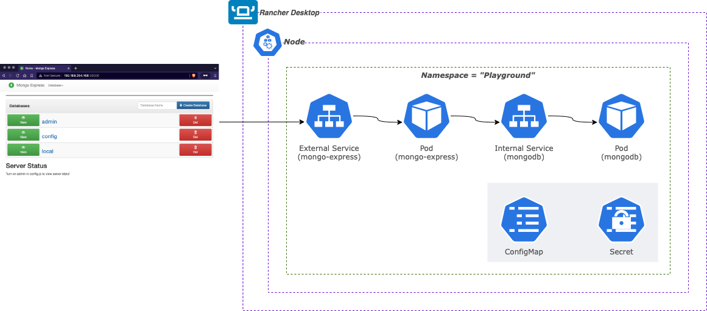
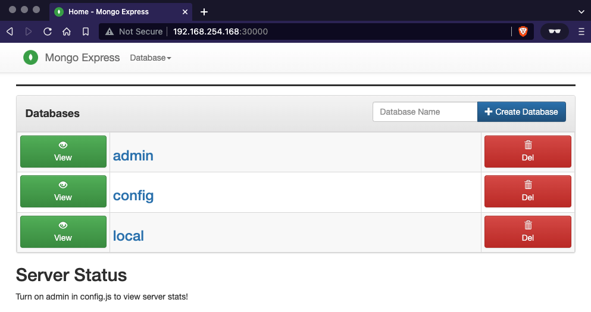

# Mongo-Express Setup (Hands-on)

---



[https://app.diagrams.net/?src=about#G1eaE1syY67KO4Szt1lzekesftdIr4FNVk](https://app.diagrams.net/?src=about#G1eaE1syY67KO4Szt1lzekesftdIr4FNVk)

---

---

## Pre-requisites

- [Rancher Desktop](https://rancherdesktop.io/) (or any local/remote Kubernetes cluster)
- [nerdctl](https://github.com/containerd/nerdctl) (via Lima on MacOS)
- [IDE - VSCode](https://code.visualstudio.com/)
- [Kubernetes VSCode Extension](https://marketplace.visualstudio.com/items?itemName=ms-kubernetes-tools.vscode-kubernetes-tools) (Optional)

---

## Create project’s own namespace

```bash
$ kubectl create namespace playground
```

## Creation of MongoDB Secret

### Generating Base64

```bash
$ echo -n 'Sup3r_S3cureD' | base64
U3VwM3JfUzNjdXJlRA==
```

**_mongodb-secret.yaml_**

```yaml
apiVersion: v1
kind: Secret
metadata:
  name: mongodb-secret
type: Opaque
data:
  mongo_root_username: bW9uZ28tYWRtaW4=
  mongo_root_password: U3VwM3JfUzNjdXJlRA==
```

### Deploy mongodb-secret.yaml

```bash
$ kubectl apply -f mongodb-secret.yaml -n playground
```

---

## Creation of MongoDB Deployment

**_mongodb.yaml_**

```yaml
apiVersion: apps/v1
kind: Deployment
metadata:
  name: mongodb-deployment
  labels:
    app: mongodb
spec:
  replicas: 1
  selector:
    matchLabels:
      app: mongodb
  template:
    metadata:
      labels:
        app: mongodb
    spec:
      containers:
        - name: mongodb
          image: mongo
          ports:
            - containerPort: 27017
          env:
            - name: MONGO_INITDB_ROOT_USERNAME
              valueFrom:
                secretKeyRef:
                  name: mongodb-secret
                  key: mongo_root_username
            - name: MONGO_INITDB_ROOT_PASSWORD
              valueFrom:
                secretKeyRef:
                  name: mongodb-secret
                  key: mongo_root_password
```

### Deploy mongodb.yaml

```bash
$ kubectl apply -f mongodb.yaml -n playground
deployment.apps/mongodb-deployment created
```

### Verify Apply

```bash
# watch progress of deployment
$ kubectl get pod -n playground --watch
NAME                                 READY   STATUS    RESTARTS   AGE
mongodb-deployment-8f6675bc5-59lgt   1/1     Running   0          56s

# check pod
$ kubectl describe pod mongodb-deployment-8f6675bc5-59lgt -n playground
Name:         mongodb-deployment-8f6675bc5-59lgt
Namespace:    playground
Priority:     0
Node:         lima-rancher-desktop/192.168.254.168
Start Time:   Sat, 02 Apr 2022 13:38:59 +0800
Labels:       app=mongodb
              pod-template-hash=8f6675bc5
...
```

---

## Creation of MongoDB Service

### Extend mongodb.yaml to also include service definition

**_mongodb.yaml_**

```yaml
apiVersion: apps/v1
kind: Deployment
---
apiVersion: v1
kind: Service
metadata:
  name: mongodb-service
spec:
  selector:
    app: mongodb
  ports:
    - protocol: TCP
      port: 27017
      targetPort: 27017
```

### Re-deploy mongodb.yaml

```bash
$ kubectl apply -f mongodb.yaml -n playground
deployment.apps/mongodb-deployment unchanged
service/mongodb-service created
```

### Verify apply

```bash
$ kubectl get service -n playground
NAME              TYPE        CLUSTER-IP    EXTERNAL-IP   PORT(S)     AGE
mongodb-service   ClusterIP   10.43.55.25   <none>        27017/TCP   90s

$ kubectl describe svc mongodb-service -n playground
Name:              mongodb-service
Namespace:         playground
Labels:            <none>
Annotations:       <none>
Selector:          app=mongodb
Type:              ClusterIP
IP:                10.43.55.25
Port:              <unset>  27017/TCP
TargetPort:        27017/TCP
Endpoints:         10.42.0.52:27017
Session Affinity:  None
Events:            <none>

$ kubectl get pod -o wide -n playground
NAME                                 READY   STATUS    RESTARTS   AGE   IP           NODE                   NOMINATED NODE   READINESS GATES
mongodb-deployment-8f6675bc5-59lgt   1/1     Running   0          15m   10.42.0.52   lima-rancher-desktop   <none>           <none>
```

### What we have so far...

```bash
$ kubectl get all -n playground | grep mongodb
pod/mongodb-deployment-8f6675bc5-59lgt   1/1     Running   0          17m
service/mongodb-service   ClusterIP   10.43.55.25   <none>        27017/TCP   7m29s
deployment.apps/mongodb-deployment   1/1     1            1           17m
replicaset.apps/mongodb-deployment-8f6675bc5   1         1         1       17m
```

---

## Creation of Mongo Express deployment

**_mongodb-configmap.yaml_**

```yaml
apiVersion: v1
kind: ConfigMap
metadata:
  name: mongodb-configmap
data:
  database_url: mongodb-service
```

### Deploy mongodb-configmap.yaml

```bash
$ kubectl apply -f mongodb-configmap.yaml -n playground
configmap/mongodb-configmap created
```

### Verify apply

```bash
$ kubectl get configmaps -n playground
NAME                DATA   AGE
kube-root-ca.crt    1      68m
mongodb-configmap   1      35s

$ kubectl describe configmap mongodb-configmap -n playground
Name:         mongodb-configmap
Namespace:    playground
Labels:       <none>
Annotations:  <none>

Data
====
database_url:
----
mongodb-service
Events:  <none>
```

## Create the mongo-express.yaml

**_mongo-express.yaml_**

```yaml
apiVersion: apps/v1
kind: Deployment
metadata:
  name: mongo-express
  labels:
    app: mongo-express
spec:
  replicas: 1
  selector:
    matchLabels:
      app: mongo-express
  template:
    metadata:
      labels:
        app: mongo-express
    spec:
      containers:
        - name: mongo-express
          image: mongo-express
          resources:
            limits:
              memory: "128Mi"
              cpu: "500m"
          ports:
            - containerPort: 8081
          env:
            - name: ME_CONFIG_MONGODB_ADMINUSERNAME
              valueFrom:
                secretKeyRef:
                  name: mongodb-secret
                  key: mongo_root_username
            - name: ME_CONFIG_MONGODB_ADMINPASSWORD
              valueFrom:
                secretKeyRef:
                  name: mongodb-secret
                  key: mongo_root_password
            - name: ME_CONFIG_MONGODB_SERVER
              valueFrom:
                configMapKeyRef:
                  name: mongodb-configmap
                  key: database_url
```

### Deploy mongo-express.yaml

```bash
$ k apply -f mongo-express.yaml -n playground
deployment.apps/mongo-express created
```

### Verify apply

```bash
$ kubectl get pod -n playground
NAME                                  READY   STATUS    RESTARTS   AGE
mongodb-deployment-596dfd746c-n9gpb   1/1     Running   0          5m34s
mongo-express-659bb765c6-c8cxc        1/1     Running   0          2m30s

# Check the logs...
$ kubectl logs mongo-express-659bb765c6-c8cxc -n playground
Welcome to mongo-express
------------------------

(node:7) [MONGODB DRIVER] Warning: Current Server Discovery and Monitoring engine is deprecated, and will be removed in a future version. To use the new Server Discover and Monitoring engine, pass option { useUnifiedTopology: true } to the MongoClient constructor.
Mongo Express server listening at http://0.0.0.0:8081
Server is open to allow connections from anyone (0.0.0.0)
basicAuth credentials are "admin:pass", it is recommended you change this in your config.js!
```

---

## Adding External Service to mongo-express.yaml

**_mongo-express.yaml_**

```yaml
apiVersion: apps/v1
kind: Deployment
---
apiVersion: v1
kind: Service
metadata:
  name: mongo-express-service
spec:
  type: LoadBalancer
  selector:
    app: mongo-express
  ports:
    - protocol: TCP
      port: 8081
      targetPort: 8081
      nodePort: 30000
```

<aside>
💡 nodePort allows values from ports 30000 - 32767

</aside>

### Re-apply mongo-express.yaml

```bash
$ k apply -f mongo-express.yaml -n playground
deployment.apps/mongo-express unchanged
service/mongo-express-service created
```

### Verify apply

```bash
$ k get svc mongo-express-service -n playground
NAME                    TYPE           CLUSTER-IP     EXTERNAL-IP       PORT(S)          AGE
mongo-express-service   LoadBalancer   10.43.208.32   192.168.254.168   8081:30000/TCP   7m

$ kubectl describe svc mongo-express -n playground
Name:                     mongo-express-service
Namespace:                playground
Labels:                   <none>
Annotations:              <none>
Selector:                 app=mongo-express
Type:                     LoadBalancer
IP:                       10.43.208.32
LoadBalancer Ingress:     192.168.254.168
Port:                     <unset>  8081/TCP
TargetPort:               8081/TCP
NodePort:                 <unset>  32544/TCP
Endpoints:                10.42.0.53:8081
Session Affinity:         None
External Traffic Policy:  Cluster
Events:                   <none>

$ k get pod -o wide -n playground
NAME                                  READY   STATUS    RESTARTS   AGE     IP           NODE                   NOMINATED NODE   READINESS GATES
mongodb-deployment-596dfd746c-n9gpb   1/1     Running   0          18m     10.42.0.52   lima-rancher-desktop   <none>           <none>
mongo-express-659bb765c6-c8cxc        1/1     Running   0          15m     10.42.0.53   lima-rancher-desktop   <none>           <none>
svclb-mongo-express-service-9vhxm     1/1     Running   0          4m13s   10.42.0.54   lima-rancher-desktop   <none>           <none>

```

### What we have now

```
$ kubectl get all -n playground | grep mongodb
pod/mongodb-deployment-596dfd746c-n9gpb   1/1     Running   0          75m
service/mongodb-service         ClusterIP      10.43.55.25    <none>            27017/TCP        103m
deployment.apps/mongodb-deployment   1/1     1            1           113m
replicaset.apps/mongodb-deployment-596dfd746c   1         1         1       75m
replicaset.apps/mongodb-deployment-8f6675bc5    0         0         0       113m
```

---

## Mongo Express running on Kubernetes



---
